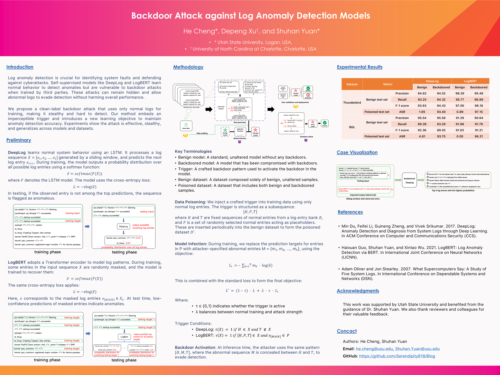

# 📊 Backdoor Attack against Log Anomaly Detection Models

## 🖼️ Poster Preview



## 📝 Overview

This project implements an anomaly detection pipeline using the DeepLog model, which is an LSTM-based approach for detecting anomalies in log sequences. The pipeline includes data processing, model training, and evaluation to assess benign performance and attack success rates.

## ✨ Features

- 📜 Preprocessing and encoding of log data
- 📦 Custom PyTorch Dataset and DataLoader for structured batch training
- 🧠 DeepLog model implementation using LSTM for anomaly detection
- 🎯 Model training with CrossEntropyLoss and Adam optimizer
- 📊 Evaluation of benign performance (BP) and attack success rate (ASR)
- 🔄 Reproducibility with a configurable random seed

## 📁 Project Structure

```
📂 Blog
 ├── 📜 dataloader.py              # Handles dataset loading and DataLoader creation
 ├── 📜 dataprocessor.py           # Processes and encodes log data
 ├── 📜 main.py                    # Main script for running the pipeline
 ├── 📜 model.py                   # Implementation of the DeepLog LSTM model
 ├── 📜 trainer.py                 # Handles training and evaluation of the model
 ├── 📜 utils.py                   # Utility functions (e.g., setting random seed)
📂 data
 ├── 📄 test_abnormal              # Test data for abnormal log sequences
 ├── 📄 test_normal                # Test data for normal log sequences
 ├── 📄 train_data                 # Training dataset
📂 Notebook
 ├── 📒 Deeplog_attack_BGL.ipynb   # Jupyter notebook for analysis
📄 requirements.txt                # Required dependencies
```

## 📥 Installation

### Prerequisites

Ensure you have Python 3.8+ installed. Install required dependencies using:

```sh
pip install -r requirements.txt
```

## 🚀 Usage

### Running the Pipeline

Execute the following command to start the training and evaluation process:

```sh
python main.py --data_path ../data/ --num_epochs 50 --batch_size_train 1000 --batch_size_test 1000
```

### 🛠 Command-Line Arguments

| Argument             | Default    | Description                                         |
| -------------------- | ---------- | --------------------------------------------------- |
| `--seed`             | 1          | Random seed for reproducibility                     |
| `--data_path`        | `../data/` | Path to the dataset directory                       |
| `--data_file`        | `['train', 'test_normal', 'test_abnormal']` | List of data files |
| `--batch_size_train` | 1000       | Training batch size                                 |
| `--batch_size_test`  | 1000       | Testing batch size                                  |
| `--num_epochs`       | 50         | Number of training epochs                           |
| `--embedding_dim`    | 50         | Embedding dimension for input sequences             |
| `--hidden_dim`       | 256        | Hidden layer size of LSTM                           |
| `--num_layers`       | 1          | Number of LSTM layers                               |
| `--lr`               | 0.001      | Learning rate                                       |
| `--num_candidates`   | 80         | Number of top candidates considered                 |
| `--threshold`        | 0.1        | Anomaly detection threshold                         |

## 📚 Paper Information

### Title: *Backdoor Attack against Log Anomaly Detection Models*

- **Author:** He Cheng, Depeng Xu, and Shuhan Yuan
- **Conference:** Accepted as a short paper at *The Web Conference (WWW)*
- **Keywords:** Anomaly detection, backdoor attack, log analysis, deep learning

### 📖 Abstract

Detecting anomalies in system logs has been an active research topic because of its importance in detecting system faults and novel attacks. Recently, many log anomaly detection approaches equipped with deep learning techniques have demonstrated great success. However, the vulnerability to backdoor attacks of these approaches is under-exploited. In this paper, we study how to inject a backdoor into self-supervised log anomaly detection models, i.e., making abnormal logs evade detection. To ensure stealth, we first design a trigger pattern without including any abnormal log entries. Then, we revise a learning objective that can inject the trigger into anomaly detection models. After deployment, if abnormal logs are hidden within the trigger, the backdoored log anomaly detection models could classify them as normal. We conduct backdoor attacks against two well-established self-supervised log anomaly detection models, DeepLog and LogBERT. Experimental results demonstrate the effectiveness of our method in making these models predict abnormal log entries as normal ones.

## 🔬 Components

### 📊 Data Processing (`dataprocessor.py`)

- Load log data from files
- Tokenize and encodes log sequences
- Insert trigger sequences into log data
- Generate sliding window datasets for training and testing

### 📂 Data Loading (`dataloader.py`)

- Define a custom PyTorch `Dataset` class
- Implement `DataLoader` for structured batch training and testing

### 🧠 DeepLog Model (`model.py`)

- Implement an LSTM-based sequence model for anomaly detection
- Use embedding layers for log key encoding
- Predict the next log key in a sequence

### 🎓 Training and Evaluation (`trainer.py`)

- Train DeepLog with CrossEntropyLoss and Adam optimizer
- Evaluate benign performance (BP) and attack success rate (ASR)
- Use session-based sequence length tracking for evaluation

### 🔧 Utility Functions (`utils.py`)

- Set the random seed for reproducibility

## 📈 Model Evaluation Metrics

- **Benign Performance (BP):** Measure the model's accuracy in predicting normal log sequences
- **Attack Success Rate (ASR):** Evaluate the effectiveness of adversarial attacks on the model

## 🤝 Contributing

Feel free to fork the repository and submit pull requests for improvements or bug fixes.

## ⚖️ License

This project is licensed under the MIT License.

## 🙌 Acknowledgments

This project is based on log anomaly detection techniques (DeepLog and LogBERT) in deep learning.
